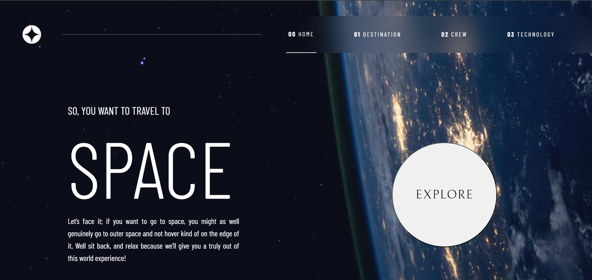
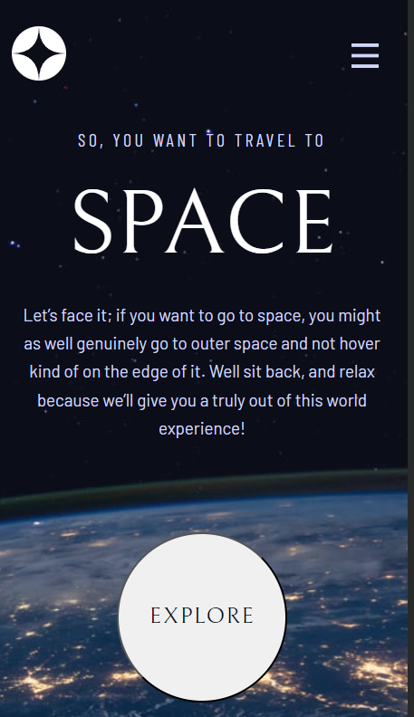

# Space-tourism-website

## Design Preview
-Desktop Design 
-Mobile Design 

## Live Site

## The challenge

Your challenge is to build out this multi-page space tourism website and get it looking as close to the design as possible.

**This project is a collaboration between Frontend Mentor, Scrimba, and Kevin Powell.**

## Aurhor

- [GitHub Pages](https://github.com/Petresara)
- [Linkedin] (https://www.linkedin.com/in/sara-petreska-28bba7304/)
- [Netlify](https://app.netlify.com/teams/petresara/sites)

## Technology Used

Front-end

 -**React**: JavaScript library for bulding user interfaces.
 -**HTML**: Markup language for structuring web content.
 -**CSS**: Stylesheet language for designing the website.
 -**Figma**: Tool for design and prototyping.
 -**Netlify**: for Deployment

## Getting Started
 1. **Clone the repository**
 2. **Navigate into the project directort**
   cd space-tourism-website
3. **Install the dependencies**
   npm install
4. **Start the development server**
   npm start
5. **Open your Browser and visit http://localhost:3000 to view the website.**

## Show Your Support
Give a ⭐️ if you like this project!

📝 License
This project is MIT licensed.